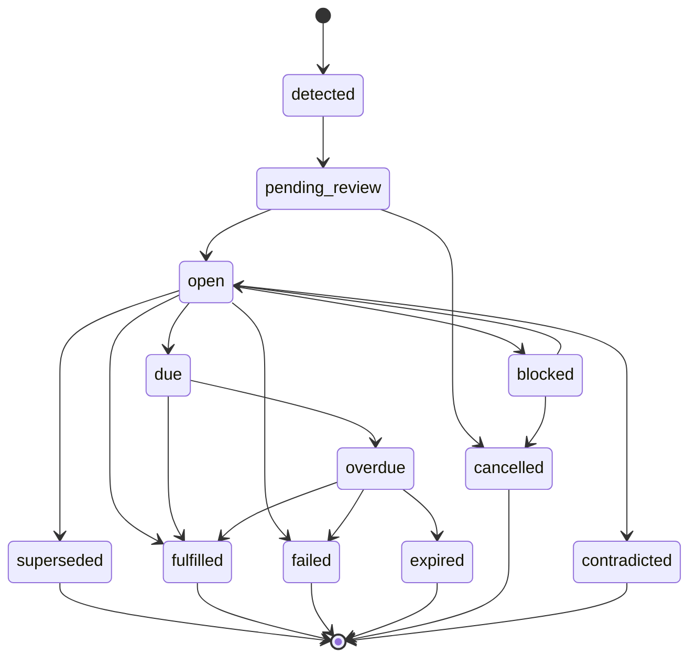

# COGEXT

> The accountability layer for machine intelligence.

[](https://github.com/cogext/cogext/actions/workflows/ci.yml)
[](https://pypi.org/project/cogext/)
[](https://www.python.org/downloads/)
[](#license)

COGEXT turns the promises AI agents make into first-class, trackable objects. It extracts
commitments from agent messages, follows them through a 12-state lifecycle, requires
evidence before they can be marked fulfilled, and scores how reliably each agent actually
keeps its word.

---

## What this solves

When an AI agent says *"I'll send the report by Tuesday EOD"* or *"I'll loop in Sarah after
the sync,"* that commitment exists only as prose in a conversation log. Nothing records that
a promise was made, nothing notices when the deadline passes, and nothing can answer the one
question that matters afterwards: **was it kept?** Agent frameworks optimise for producing
plausible output, not for being held to it.

Today's workarounds all fall short. Memory and retrieval tools store the sentence as a text
chunk, so you can search for it later but never evaluate it. Tracing and observability
platforms capture *what the model did* — tokens, latency, tool calls — but have no concept of
a promise that outlives the request. Human review queues and checklists depend on someone
remembering to look. In each case the commitment has no identity, no state and no evidence
trail, so accountability stays manual and unreliable.

COGEXT closes that gap by treating a commitment as a record with a lifecycle. Ingestion runs
structured LLM extraction over the message and writes each commitment to Postgres with its own
identity, deadline, confidence, shape and verifier query. From there the state machine governs
every transition, an evidence gate prevents self-reported success from counting as fulfilment,
and a contradiction detector catches the case where an agent quietly revises a promise it
already made. Reliability is then a query rather than a guess.

---

## Quickstart

```bash
pip install cogext
```

```python
from cogext import track

tracked = track(my_agent, api_key="cg_live_...", user_id="<your-user-id>", agent_id="<your-agent-id>")
tracked.run("Send the quarterly report to Priya by Friday EOD")
```

That is the whole integration. `track()` wraps your existing agent, lets its output pass
through untouched, and ingests the message in the background.

**What happens next:** the commitment is extracted and stored with an idempotency key, routed
to `open` or `pending_review` depending on its shape and confidence, and scored for failure
risk. You can then read it back:

```python
from cogext import CogextClient

client = CogextClient(api_key="cg_live_...", user_id="<your-user-id>")
for c in await client.get_commitments():
    print(c["status"], c["promise_text"])
```

Get an API key at [cogextai.com](https://cogextai.com) — free, no credit card.

---

## Research

COGEXT publishes original research on AI agent accountability.

**[Research 01: When AI Acts, Who Remembers What Happened?](https://cogextai.com/research/01)**

We audited 120 AI agent outputs from public cookbooks and 
repositories. 92% of extracted commitments had no deadline. 
61% had no recipient. Most promises agents make are 
structurally unverifiable.

**[The COGEXT Standard v0.1](https://cogextai.com/standard)**

An open specification for how AI agents should track commitments. 
Six requirements. Compliance test and adoption index shipping soon.

---

## Core Concepts

### The Commitment object

Every commitment is a row with a stable identity, not a text blob:

| Field | Why it exists |
|---|---|
| `promise_text` | The promise as expressed, preserved verbatim |
| `action` / `object` / `recipient` | Structured decomposition, so promises can be compared |
| `due_condition` | When/how it becomes due — a deadline, an event, or a state |
| `deadline` / `deadline_expression` | Parsed UTC deadline plus the original phrasing |
| `shape` | `external_side_effect` (needs proof) or `logged_intent` (self-reported) |
| `confidence` | How certain extraction is that a real commitment was made |
| `status` | Lifecycle position (see below) |
| `verifier_query` | Plain-English statement of what would prove fulfilment |
| `verification_status` | Result of evidence evaluation |
| `risk_score` / `risk_reasons` | Predicted failure likelihood and the factors behind it |
| `idempotency_key` | Stable hash so re-ingesting the same message never duplicates |
| `receipt_token` | HMAC token for public, tamper-evident verification |

### The 12-state lifecycle



Transitions are not arbitrary writes. They are validated in Python
(`app/core/state_machine.py`) and applied through a single Postgres function,
`cogext_transition_commitment`, so concurrent updates cannot race. Every transition appends to
`commitment_events`, an append-only log that forms the audit trail.

### Evidence verification

`external_side_effect` commitments start as `pending_review` and **cannot be fulfilled by the
agent's own say-so**. Evidence arrives through adapters (`app/core/evidence_adapters/`) — Gmail
and a generic webhook adapter ship today — and is normalised to a common shape, then scored for
relevance against the commitment's fields. The verifier engine auto-transitions to `fulfilled`
at a relevance score of ≥ 0.70 and marks evidence `insufficient` at ≤ 0.30. Anything between
stays `pending` for a human. Each commitment carries the `verifier_query` generated at ingest,
so the question being asked is fixed at the moment of the promise rather than invented later.

### Reliability scoring

Reliability is computed per agent from its own history rather than asserted: the ratio of
commitments kept to commitments that reached a terminal state, exposed through
`GET /api/v1/reliability`. Separately, `risk_score` (0–1) predicts the chance a *newly ingested*
commitment will fail, using seven heuristics — shape, vagueness, deadline pressure, the agent's
historical failure rate, number of external conditions, high-stakes domain keywords, and
deadline language with no parseable anchor. No LLM call is involved, so it is fast and cheap.

---

## Architecture

```text
┌─────────────────────────────────────────────────────────────┐
│                     AGENT OUTPUT                            │
│         "I'll send the report to Sarah by Friday"           │
└──────────────────────────┬──────────────────────────────────┘
                           │
                           ▼
┌─────────────────────────────────────────────────────────────┐
│                    EXTRACTION                               │
│                                                             │
│  • Classifies: commitment / question / intention            │
│  • Extracts: action, object, recipient, deadline            │
│  • Generates: verifier_query                                │
│  • Assigns: confidence score                                │
└──────────────────────────┬──────────────────────────────────┘
                           │
                           ▼
┌─────────────────────────────────────────────────────────────┐
│                  STATE MACHINE                              │
│                                                             │
│  DETECTED → OPEN → DUE → OVERDUE → FULFILLED / FAILED       │
│                                                             │
│  Enforced at the database level via PostgreSQL function     │
└──────────────────────────┬──────────────────────────────────┘
                           │
                           ▼
┌─────────────────────────────────────────────────────────────┐
│                  EVIDENCE VERIFICATION                      │
│                                                             │
│  Gmail  │  Webhooks  │  Custom                              │
└──────────────────────────┬──────────────────────────────────┘
                           │
                           ▼
┌─────────────────────────────────────────────────────────────┐
│                    OUTCOME                                  │
│                                                             │
│  • Status: fulfilled / failed / expired                     │
│  • Audit receipt: HMAC-signed, publicly verifiable          │
│  • Reliability score updated                                │
└─────────────────────────────────────────────────────────────┘
```

COGEXT is deliberately asymmetric: ingestion is a write-heavy, latency-sensitive path (LLM
extraction then an immediate Postgres write), while queries are read-heavy and can be cached or
pre-aggregated. FastAPI serves both; Supabase provides Postgres plus PostgREST; Groq runs the
extraction model.

---

## Features

<table>
<tr>
<td width="50%" valign="top">

### Verifier Engine
Checks Gmail and generic webhooks today to prove a commitment was 
actually fulfilled. Blocks the `fulfilled` state without external 
evidence. GitHub and Stripe adapters on the roadmap.

</td>
<td width="50%" valign="top">

### Kill Switch
High-risk agent actions pause for human approval via Slack before 
executing. Prevents the next Hugging Face breach.

</td>
</tr>
<tr>
<td width="50%" valign="top">

### Contradiction Radar
Detects when agents contradict themselves across conversational 
turns. Superseded commitments are tracked, not silently overwritten.

</td>
<td width="50%" valign="top">

### Failure Predictor
Every commitment gets a risk score at creation. Warns before the 
deadline, not after.

</td>
</tr>
<tr>
<td width="50%" valign="top">

### Public Audit Receipts
HMAC-verified proof URL for every commitment. Anyone can verify. 
Regulators can audit.

</td>
<td width="50%" valign="top">

### 12-State Lifecycle
Deterministic state machine enforced at the database level. No 
status mutation without validation.

</td>
</tr>
</table>

---

## API Reference

Interactive docs (OpenAPI): **https://api.cogextai.com/docs**

All endpoints are under `https://api.cogextai.com/api/v1` and require
`Authorization: Bearer cg_live_...`, except `POST /keys/signup`, the PayPal billing webhook and
public receipt verification.

---

## SDK Reference

The Python SDK lives in [`sdk/`](sdk/) and is published to PyPI as
[`cogext`](https://pypi.org/project/cogext/). See [`sdk/README.md`](sdk/README.md) for the full
surface, which covers `track()`, `CogextClient` and the exception hierarchy.

---

## Local Development

**Prerequisites:** Python 3.12, Git, and credentials for Supabase and Groq.

```bash
git clone https://github.com/cogext/cogext.git
cd cogext
python -m venv venv
source venv/bin/activate          # Windows: venv\Scripts\activate
pip install -r requirements.txt
cp .env.example .env              # then fill in the values below
uvicorn app.main:app --reload
```

The API runs at `http://localhost:8000`; interactive docs are at
`http://localhost:8000/docs` and the health check is `http://localhost:8000/health`.

### Environment variables

Every key must be declared on `Settings` in `config.py` — pydantic-settings rejects unknown
keys found in `.env`, so adding an undeclared variable will crash startup.

| Variable | Required | Default | Notes |
|---|---|---|---|
| `DATABASE_URL` | **yes** | — | Supabase pooler URL (port 6543, not 5432) |
| `SUPABASE_URL` | no | `""` | Project URL |
| `SUPABASE_ANON_KEY` | no | `""` | Anon key |
| `SUPABASE_SERVICE_ROLE_KEY` | no | `""` | Service role key — server-side only |
| `LLM_PROVIDER` | no | `groq` | `groq` or `openai` |
| `GROQ_API_KEY` | no | `""` | From console.groq.com |
| `GROQ_MODEL` | no | `llama3-70b-8192` | |
| `DEEPSEEK_API_KEY` | no | `""` | Alternative provider |
| `DEEPSEEK_MODEL` | no | `deepseek-chat` | |
| `APP_ENV` | no | `development` | Set to `production` on Render |
| `SLACK_WEBHOOK_URL` | no | `""` | Kill Switch alerts |
| `ACTION_TOKEN_SECRET` | no | `""` | HMAC secret for one-click action tokens |
| `RESEND_API_KEY` | no | `""` | Preferred email transport (HTTPS) |
| `NOTIFY_EMAIL` | no | `hello@cogextai.com` | Where signup alerts are sent |
| `NOTIFY_FROM` | no | `hello@cogextai.com` | Must be on a Resend-verified domain |
| `SMTP_HOST` | no | `smtp.gmail.com` | Fallback only, when `RESEND_API_KEY` is empty |
| `SMTP_PORT` | no | `465` | Blocked on Render's free tier |
| `SMTP_USER` | no | `""` | |
| `SMTP_PASSWORD` | no | `""` | |
| `PAYPAL_WEBHOOK_ID` | no | `""` | Billing webhook verification |

---

## Testing

```bash
pytest                    # unit tests — no database required
RUN_DB_TESTS=true pytest  # adds database-backed integration + acceptance tests
```

Unit tests are hermetic and run in well under a second. Database-backed tests hit a real
Supabase instance, so they are skipped unless `RUN_DB_TESTS=true` is set. `scripts/test.sh` runs
both passes in sequence, and `make test` / `make test-all` wrap the two commands.

The SDK has its own suite:

```bash
pytest sdk/tests -q
```

Its end-to-end test needs a live API and is skipped unless `RUN_E2E_TESTS=true`.

---

## Deployment

| Component | Platform | Notes |
|---|---|---|
| Backend API | **Render** | `Procfile` runs `uvicorn app.main:app`. Requires the environment variables above |
| Frontend | **Cloudflare Pages** | Static site in the separate `cogext-web` repository |
| Database | **Supabase** | Apply `migrations/001` → `006` in order via the SQL editor |

Two operational notes learned the hard way:

- **Render's free tier blocks outbound SMTP** on ports 25, 465 and 587, and drops the packets
  rather than refusing them. Use `RESEND_API_KEY`; the SMTP fallback cannot work there.
- **Free instances spin down** after inactivity, so the first request after a quiet period can
  take 50–70 seconds. `pinger/` is a Cloudflare Worker that pings `/health` every 10 minutes to
  keep it warm.

---

## Roadmap

| Version | Status | Focus |
|---|---|---|
| v1.0 | ✅ Shipped | Ingest, extract, store, API-key auth, SDK, 12-state lifecycle |
| v1.6–v1.7 | ✅ Shipped | Evidence, dependencies, human reviews, event stream |
| v1.9 | ✅ Shipped | Shape routing, timezone-aware deadlines, verifier queries, evidence gate |
| v2.0 | ✅ Current | Contradiction Radar, Failure Predictor, Audit Receipt, Verifier Engine, Kill Switch |
| v3.0 | Planned | SLA monitors, multi-agent orchestration trust layer |

---

## Open Source Components

While this repository is proprietary, some adjacent components are 
open source:

- [cogext-primitive](https://github.com/yaminbinyoosuf/cogext-primitive) — local commitment extraction (MIT)
- [cogext-compliance](https://github.com/yaminbinyoosuf/cogext-compliance) — test the standard (MIT)
- [COGEXT Standard v0.1](https://cogextai.com/standard) — the specification (CC BY 4.0)

---

## Security

Please report vulnerabilities privately to **hello@cogextai.com** rather than opening a public
issue. [SECURITY.md](SECURITY.md) covers scope, response timelines and our credit policy.

---

## License

Copyright (c) 2026 Yamin / THRYVIX. All rights reserved.

This repository is proprietary. See [LICENSE](LICENSE) for terms.

Open-source components (primitive, compliance, standard) are licensed 
separately under MIT and CC BY 4.0.

---

Built in Kerala, India. [cogextai.com](https://cogextai.com) · 
[docs.cogextai.com](https://docs.cogextai.com) · 
[api.cogextai.com](https://api.cogextai.com)

<!--
Suggested GitHub repository topics (set under repo Settings → Topics):
python, fastapi, ai-agents, llm, agent-observability, accountability, postgres, supabase,
commitment-tracking, reliability, ai-safety, developer-tools
-->
